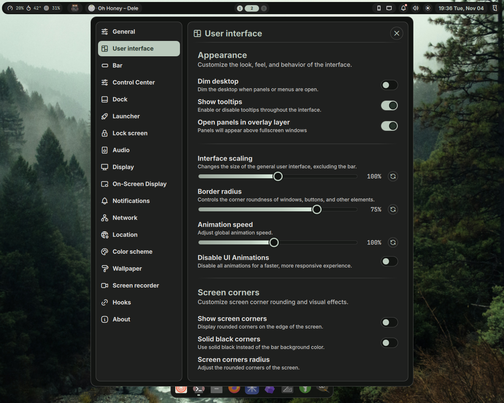

# Dotfiles

> The **Noctalia shell** and **Niri** configurations in this repository are **outdated**. I no longer use **Niri**, as I’ve switched to **KDE Plasma**.
> 
> If you’re planning to use these configs for **Niri** or **Noctalia**, expect breakage and missing updates.

## Install

```sh
chezmoi init sodabyte
```

## Screenshots



