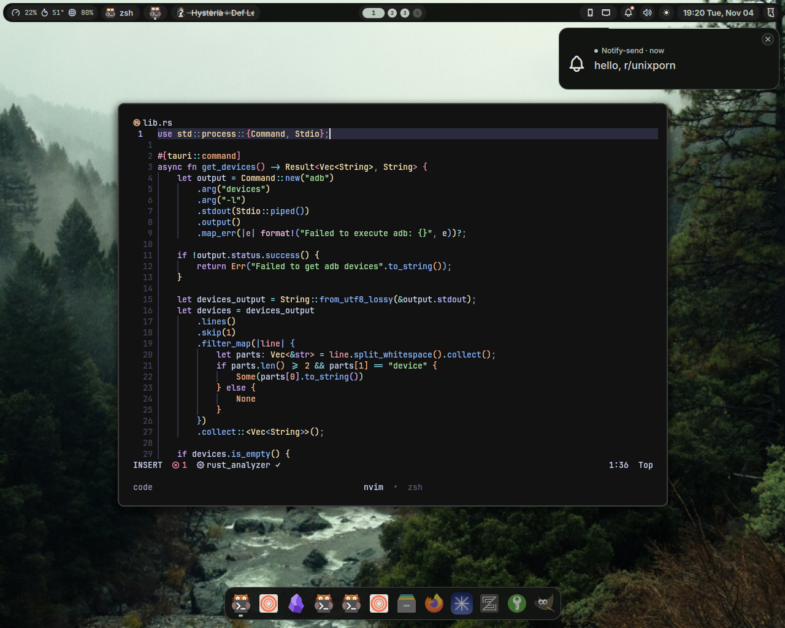
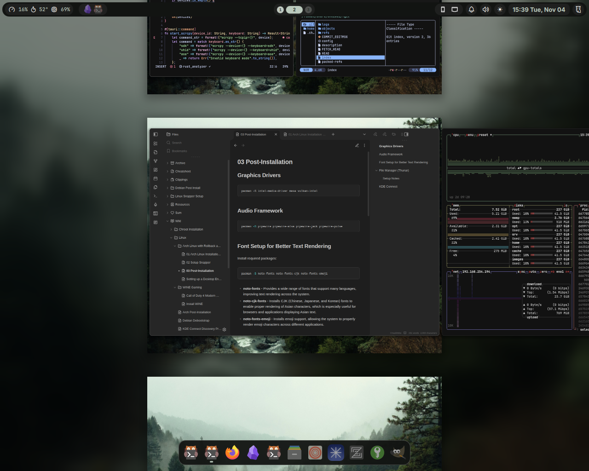
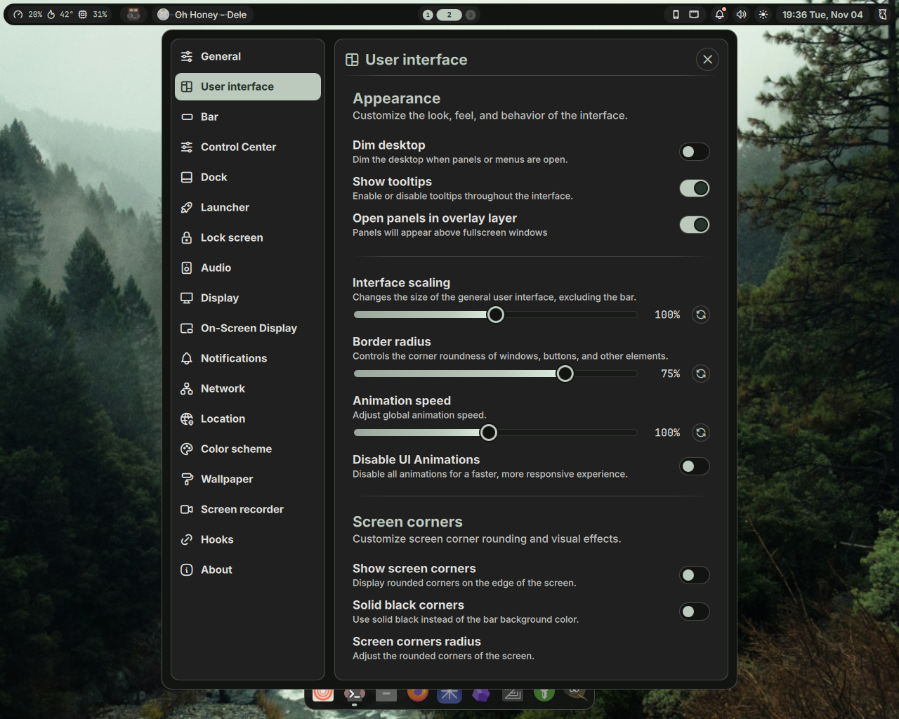

# Dotfiles

> The **Noctalia shell** and **Niri** configurations in this repository are **outdated**. I no longer use **Niri**, as I’ve switched to **KDE Plasma**.
> 
> If you’re planning to use these configs for **Niri** or **Noctalia**, expect breakage and missing updates.

## Install

```sh
# install chezmoi
sh -c "$(curl -fsLS get.chezmoi.io/lb)"

# install chezmoi and dotfiles
sh -c "$(curl -fsLS get.chezmoi.io/lb)" -- init --apply sodabyte
```

## Screenshots






